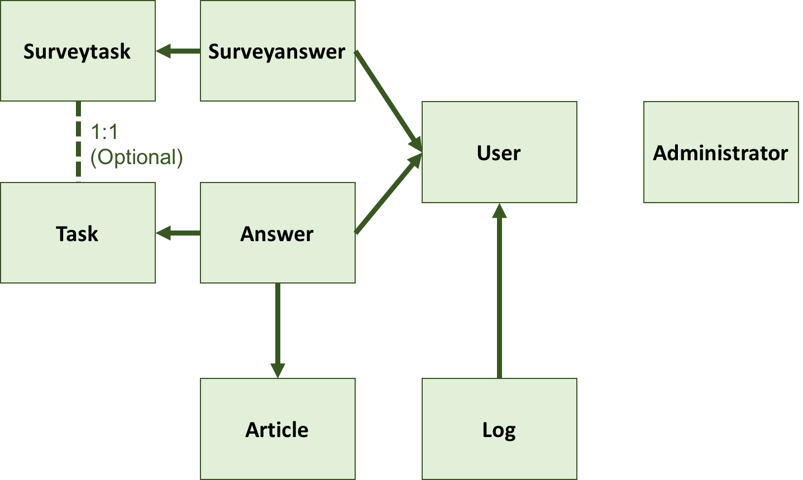

# Gaemi Doc

### 모델 구조 (DB)

- **Models**:  `db/schema.rb`에서 확인 가능

  - 자주 쓸 모델
    1. `Surveytask` : survey 문항 (prefixed)
      
      - `classification` 칼럼에는 3가지 value가 들어간다
      
        1) `gold task` : quality control을 위한 gold task 문항
      
        2) `interest` : 각 task에 대한 흥미도를 조사하는 문항
      
        3) `motivation` : "Why did you stop answering questions in section 2?"
      
        4) `content` : quality control을 위해 article 내용 질문하는 문항
    2. `Surveyanswer` : survey에 대한 user의 답변
    1. `Task` : microtask questions (prefixed)
    1. `Answer` : microtask에 대한 user의 답변 
    1. `User` : 실험 참가자들
  - 현재로서는 사용 안하는 모델
    1. `Article` : article 여러 개 할 경우를 대비하여 만듦. 현재는 coconut 아티클 딱 하나만 prefixed된 instance로 해놓고 무조건 `articles/1`로 가곤 함.
    1. `Log` : 유저의 행동 (스크롤 등) 저장하려고 만듦.
    1. `Administrator` : trestle이라는 어드민 페이지 생성에 필요한 모델. 우리가 직접 건드릴 필요 없음.

- **Relations**: `app/models/*.rb`에서 확인 가능

  - `User` has_many

    - `Log`s
    - `Answer`s
    - `Surveyanswer`s

  - `Surveytask` has_many `Surveyanswer`s

  - `Task` has_many `Answer`s

  - `Task` has_many `Surveytask`s

    - has_many로 구현하지만 사실상 1:1 관계
    - optional한 관계여서 classification이 `gold task`인 `Surveytask`의 경우에만 `Task`와 연결된다. 즉 gold task가 어떤 `Task`에 대응되는지를 표시하기 위한 칼럼. 
    
  - `Article` has_many `Answer`s
  
    - article 여러 개 할 경우를 대비하여 정의한 관계
  
    

### 자주 쓸 디렉토리

https://github.com/jwipeout/rails-directory-structure-guide

- **app/assets**
  - `javascripts` : highlight 관련
- **db**
  - `migrate` 폴더 안의 파일들은 각 모델에 대응됨 : 모델 수정. (모델에 칼럼을 추가/삭제할 때)
    - 모델 수정 후에는 반드시 `rake db:drop && rake db:migrate && rake db:seed` 을 terminal에서 run해줄 것. drop없이 incremental하게 할 수 없지만 설명하기 복잡.
  - `schema.rb` : 모델 잘 수정되었는지 확인 가능
  - `seeds.rb` : prefixed instances(questions, 테스트용 유저, 테스트용 답변 등)를 만드는 곳.
    - seed 수정 후에도 반드시 `rake db:drop && rake db:migrate && rake db:seed` 을 run
- **config**
  - `routes.rb` : 경로 설정

### 현재 TODO별 바꿔야 하는 곳들

1. Article + content question (읽는 걸 확실히 하기 위해 틀리면 되돌려보내기, 맞을 때까지 풀게하기, 찍는 걸 방지하기 위해 주관식)

   - `db/seeds.rb`에서 `Surveytask.create` 부분에 새로운 content questions를 넣기 (맨앞에 넣기)
   - `survey.html.erb`에서 
     - `Surveytask.all.take( content questions의 개수 )` 로 고치기
     - `if`문이 현재는 해당 question에 대한 답변이 0개일 때만 그 question이 보이도록 하고 있음. 맞을 때까지 풀게 하기 위해서는 `Surveyanswer`에 `isCorrect` 칼럼을 추가해서, 해당 답변을 저장할 당시에 답변이 맞는지 틀린지 boolean으로 저장. 이렇게 바꿀 경우 `if`문은 `isCorrect`를 체크하는 것으로 변경
     - 주관식으로 하기 위해서는 `partials/_survey_form.html.erb`에서 알맞게 양식을 수정해주면 됨. 25번째 줄 input 태그 사용.

2. Randomized & Sequence constrained

   

3. Remove pre-survey questions about gold task

   - `db/seeds.rb`에서 기존 `Surveytask.create` 부분의 gold task들 삭제

4. Alternatively, general/singular causal claim 설명 붙이기

   - `partials/_task.html.erb`에서 if문으로 task_id 체크 후 설명 보여주기 

5. Fake message about contribution to the modelUser will see “you can contribute to (5%) of confidence of this claim’s veracity by answering this question.”

   - `User` 모델에 `contribution` 칼럼 추가
   - `articles/show.html.erb`에서 `<section class="sidebar">` 하위 div를 하나 추가해준 후, `@current_user.contribution`을 출력.

6. Post-survey question: “Why are you leaving” + (1 or more questions answered) “What makes you to contribute” + “AI랑 일했다고 생각하니?”